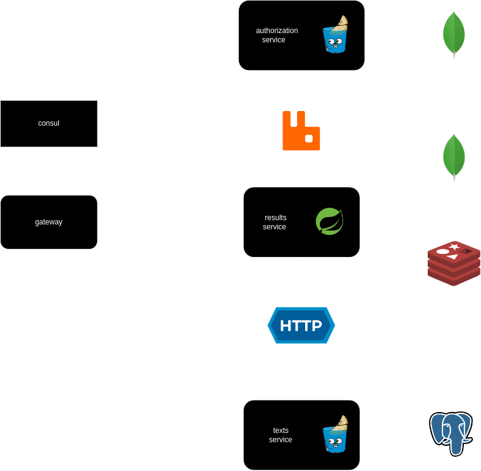

# Backend for Code Typing project

this is the main repo for all code-typing microservices

[the backend is being created for this code-typing frontend repo](https://github.com/denischagin/code-typing)

### how to run:

```shell
docker compose up -d
```

### architecture



### all services:

- [gateway service](https://github.com/ttodoshi/code-typing-gateway-service)
- [result service](https://github.com/ttodoshi/code-typing-result-service)
- [auth service](https://github.com/ttodoshi/code-typing-auth-service)
- [text service](https://github.com/ttodoshi/code-typing-text-service)
